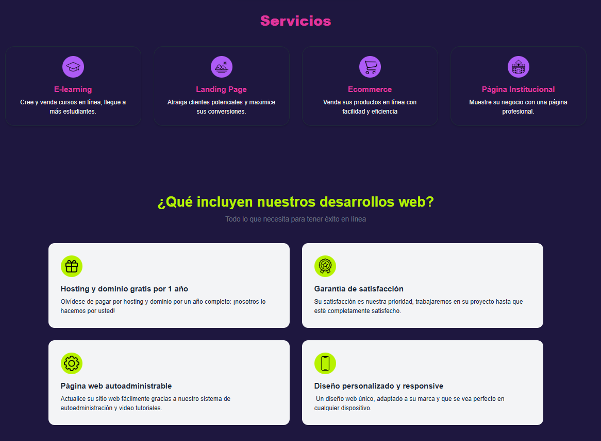
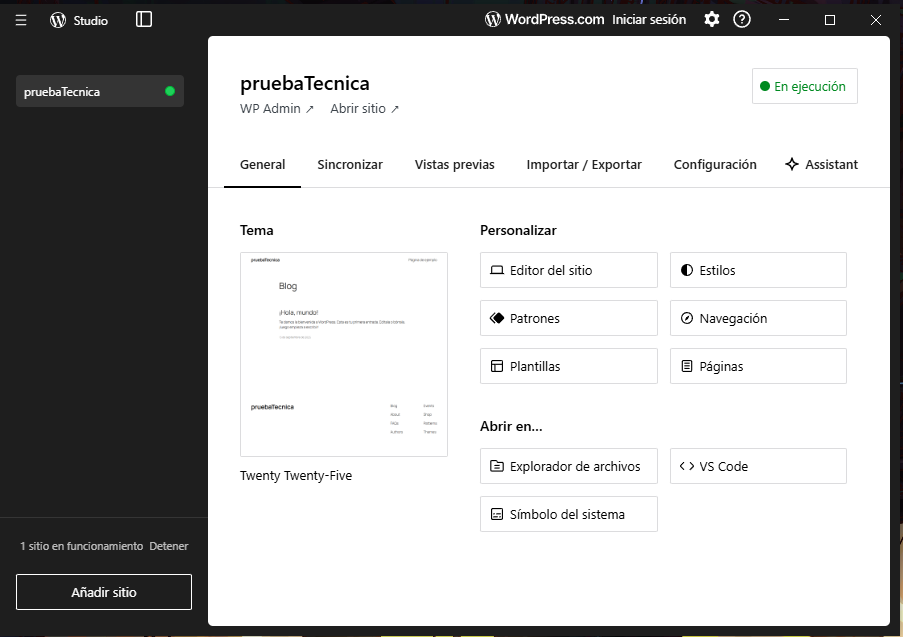
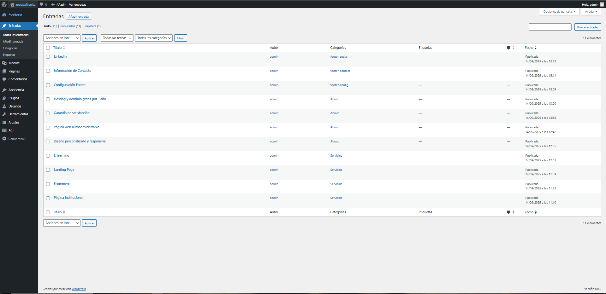

# Lader - Prueba Tecnica


## Tecnologías Utilizadas 👩‍💻

**Astro:** Para el frontend de la página.

**WordPress:** Use wordpress headless para gestionar el contenido de forma dinámica a través de la api de wordpress. En este caso la use para obtener los servicios, la informacion de lo que ofrece la agencia.



**Tailwind CSS:** Para el estilo de los componentes, lo que me ayudó a dar estilo a la página de forma rápida y con un enfoque mobile-first.

**TypeScript:** Para el fetch de datos **(consumir la api de wordpress)** y la lógica de la página.

## Trabaje de forma local con wordpress studio 🏡



**Algunas de las entradas/paginas creadas en wordpress**




Para ejecutar el proyecto:

```sh
npm install
npm run dev
```

> 🧑‍🚀

## 🚀 Estructura del proyecto

carpetas y archivos:

```text
/
├── public/
│   └── favicon.svg
├── src
│   ├── assets
│   │   └──
│   ├── components
│   │   └── Hero.astro
│   │   └── Servicios.astro
│   │   └── Card.astro
│   │   └── About.astro
│   │   └── Contacto.astro
│   │   └── Footer.astro
│   │   └── Navbar.astro
│   │   └── FeatureCard.astro
│   │   └── Info.astro
│   │   └── Servicios.astro
│   ├── layouts
│   │   └── Layout.astro
│   ├── lib
│   │   └── lib.ts
│   └── pages
│   │   └── index.astro
│   └── styles
│   │   └── globals.css
└── package.json
```

To learn more about the folder structure of an Astro project, refer to [our guide on project structure](https://docs.astro.build/en/basics/project-structure/).

## 🧞 Comandos

Todos los comandos se ejecutan desde la raiz del proyecto, desde un terminal:

| Command         | Action                                      |
| :-------------- | :------------------------------------------ |
| `npm install`   | Installs dependencies                       |
| `npm run dev`   | Starts local dev server at `localhost:4321` |
| `npm run build` | Build your production site to `./dist/`     |

## 👀 Want to learn more?
